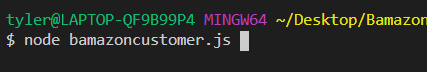

# bamazon
Simulated storefront. Created with javascript, and node on a mysql database to demonstrate proficiency in database structuring.

#instructions:
1. Clone repository 
2. Open the folder into gitbash terminal
3. Install the packages within the package.json "npm install"
4. Configure your mysql connection
5 Enter the following:

Then you will arrow as a guide to make simulated purchases

